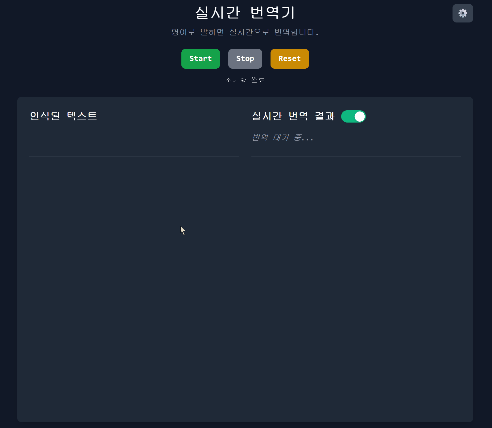

# Real-time Translator

[English](README.md) | [한글](README_KR.md)

A web application for real-time speech recognition and translation using AssemblyAI and DeepL APIs.



## Features

### Core Functionality
- **Real-time Speech Recognition**: Speech-to-text with AssemblyAI WebSocket API v3
- **Instant Translation**: Text translation using DeepL API
- **Dual Audio Capture**: Supports both microphone input and system audio (tab audio)
- **Live Transcription**: Real-time interim and final transcript display
- **Text Selection Translation**: Translate any selected text on the page
- **Interactive Result Navigation**: Click-to-scroll linking between speech recognition and translation results

### Technical Highlights
- **High Accuracy**: >91% speech recognition accuracy with AssemblyAI
- **Low Latency**: ~300ms recognition latency for real-time performance
- **Audio Processing**: AudioContext + PCM16 format for optimal compatibility
- **Reconnection Logic**: Automatic WebSocket reconnection with exponential backoff

## Architecture

### Frontend
- Static HTML/CSS/JavaScript (no build process)
- ES6 module-based component architecture
- Responsive UI with **Tailwind CSS**
- Interactive Features with Click navigation

### Backend Services
- **Netlify Functions**: Serverless backend for API key management

### APIs and Services
- **AssemblyAI**: Real-time speech recognition via WebSocket streaming
- **DeepL**: Translation services
- **Netlify**: Hosting and serverless functions

## Technical Implementation

### Speech Recognition
```javascript
// AudioContext-based audio processing
const audioContext = new AudioContext({ sampleRate: 16000 });
const processor = audioContext.createScriptProcessor(4096, 1, 1);

// Float32 to PCM16 conversion for AssemblyAI
const pcm16Buffer = convertFloat32ToInt16(audioData);
websocket.send(pcm16Buffer);
```

### Interactive Result Navigation
```javascript
// Data-linking system between recognition and translation results
const resultId = `result_${Date.now()}_${Math.random().toString(36).substr(2, 9)}`;
recognitionResult.setAttribute('data-result-id', resultId);
translationResult.setAttribute('data-translation-for', resultId);

// Smart scroll positioning with responsive layout detection
const isVerticalLayout = finalResultsTop !== translationContainerTop;
const scrollBehavior = isVerticalLayout ? 'center' : 'position-sync';
```

### Dual Audio Strategy
1. **Primary**: Tab audio capture using `getDisplayMedia()` (Chrome/Edge)
2. **Fallback**: Microphone capture
3. **Echo Cancellation**: Disabled to allow speaker audio recognition

### WebSocket Integration
- **Connection Management**: Automatic reconnection with backoff strategy
- **Message Handling**: Real-time processing of interim and final transcripts

## Setup and Installation

### Prerequisites
- Modern web browser with WebRTC support
- HTTPS hosting (required for microphone access)
- AssemblyAI API key
- DeepL API key

### Environment Configuration
Create environment variables in your hosting platform:
```
ASSEMBLYAI_API_KEY=your_assemblyai_api_key
DEEPL_API_KEY=your_deepl_api_key
```

### Local Development
```bash
npm install
npm run dev
npm run deploy
```

### Netlify Deployment
1. Connect repository to Netlify
2. Configure environment variables in Netlify dashboard
3. Deploy automatically on push to main branch

## Browser Compatibility

### Supported Browsers
- **Chrome/Edge**: Full feature support including tab audio capture
- **Firefox**: Microphone-only audio capture
- **Safari**: Basic functionality with limitations

### Required APIs
- WebRTC MediaDevices API
- WebSocket API
- AudioContext/Web Audio API
- Fetch API

## Performance Characteristics

### Speech Recognition
- **Accuracy**: >91% for clear English speech
- **Latency**: ~300ms from speech to transcript
- **Sample Rate**: 16kHz mono audio
- **Format**: PCM16 for optimal AssemblyAI compatibility

### Translation
- **Speed**: <500ms for typical phrases
- **Quality**: Professional-grade DeepL translation
- **Languages**: Supports all DeepL language pairs

### Resource Usage
- **Memory**: <50MB typical usage
- **CPU**: <5% on modern devices
- **Network**: ~64kbps for audio streaming

## API Integration

### AssemblyAI WebSocket
```javascript
// Secure token generation via Netlify function
const response = await fetch('/.netlify/functions/assemblyai-token');
const { wsUrl } = await response.json();
const websocket = new WebSocket(wsUrl);
```

### DeepL Translation
```javascript
// CORS-free translation via proxy function
const response = await fetch('/.netlify/functions/deepl-translate', {
    method: 'POST',
    headers: { 'Content-Type': 'application/json' },
    body: JSON.stringify({ text, targetLang: 'KO' })
});
```

## Security Considerations

### API Key Protection
- Server-side token generation prevents client-side API key exposure
- Environment variable configuration for secure key management
- Netlify Functions provide secure execution environment

### HTTPS Requirement
- Required for microphone access via getUserMedia()
- Ensures secure WebSocket connections
- Protects against man-in-the-middle attacks


### Code Structure
```
assets/
├── js/
│   ├── modules/           # Feature modules
│   │   ├── ui.js         # UI management and navigation
│   │   ├── realtimeTranslation.js  # Translation handling
│   │   └── speechRecognition.js   # AssemblyAI integration
│   ├── utils/            # Utility functions
│   └── app.js           # Main application entry
├── css/
│   ├── styles.css        # Core styling
│   └── highlight-effects.css  # Interactive animations
└── ...

netlify/functions/    # Serverless backend
docs/                # Documentation and analysis
```


## Version History

### v2.1 (Current)
- **Interactive Result Navigation**: Click-to-scroll linking between speech recognition and translation results
- **Visual Feedback**: Animations and hover effects for better interaction
- **Responsive Navigation**: Adjusts scroll position based on desktop/mobile layout
- **Data Linking**: Unique ID system connecting recognition results to translations

### v2.0
- AssemblyAI API integration with dual audio capture
- AudioContext-based audio processing
- Enhanced error handling and reconnection logic
- Production-ready performance optimizations

### v1.0
- Initial release with Web Speech API
- Basic real-time translation functionality
- DeepL API integration via Netlify Functions