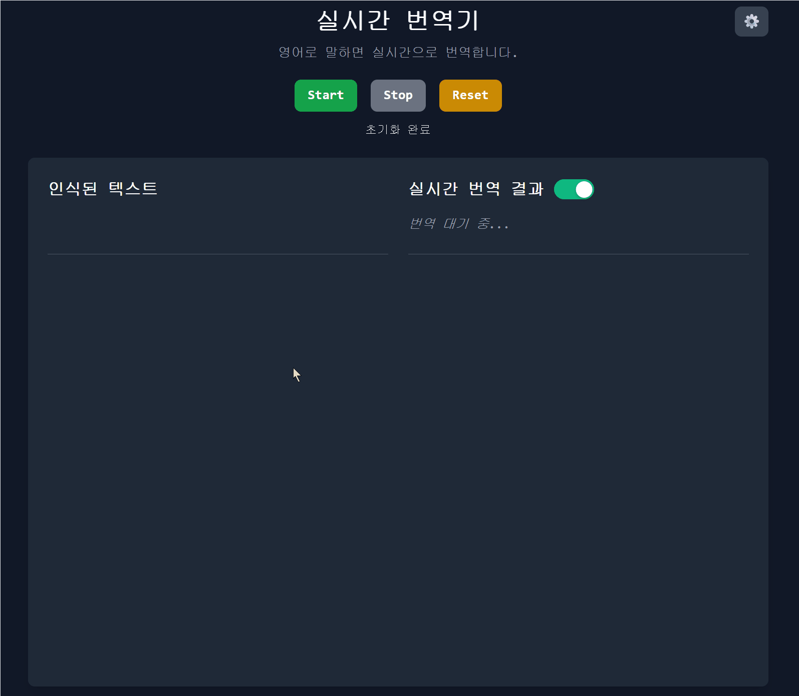

# 🔃 실시간 번역기

[English](README.md) | [한글](README_KR.md)

AssemblyAI 음성 인식과 DeepL 번역 API를 활용한 실시간 음성-텍스트 변환 및 번역 웹 애플리케이션입니다.



## 주요 기능

### 핵심 기능
- **실시간 음성 인식**: AssemblyAI WebSocket API v3 기반 음성-텍스트 변환
- **실시간 번역**: DeepL API를 사용한 텍스트 번역
- **듀얼 오디오 캡처**: 마이크 입력 및 시스템 오디오(탭 오디오) 지원
- **실시간 텍스트 변환**: 임시 및 최종 텍스트 실시간 렌더링
- **텍스트 선택 번역**: 페이지 내 텍스트 선택 후 번역 가능
- **결과 연동 스크롤**: 필사 원문 클릭 시 스크롤 이동을 통해 번역 결과를 나란히 표시함.
- **노트 패널**: 노트 패널에 원문 & 번역문 저장 및 다운로드 가능

### 기술적 특징
- **높은 정확도**: AssemblyAI로 91% 이상의 음성 인식 정확도
- **낮은 지연 시간**: 실시간 성능을 위한 약 300ms 인식 지연 시간
- **오디오 처리**: 최적 호환성을 위한 AudioContext + PCM16 형식
- **재연결 로직**: 지수 백오프를 통한 자동 WebSocket 재연결

## 아키텍처

### 프론트엔드
- HTML/CSS/JavaScript 기반, 빌드 과정 불필요
- ES6 모듈을 활용한 컴포넌트 구조
- **Tailwind CSS**를 사용한 반응형 UI
- 결과 연동 스크롤 이동

### 백엔드 서비스
- **Netlify Functions**: API 키 관리를 위한 서버리스 백엔드

### API 및 서비스
- **AssemblyAI**: WebSocket 스트리밍을 통한 실시간 음성 인식
- **DeepL**: 텍스트 번역
- **Netlify**: 호스팅 및 서버리스 함수

## 기술적 구현

### 음성 인식
```javascript
// AudioContext 기반 오디오 처리
const audioContext = new AudioContext({ sampleRate: 16000 });
const processor = audioContext.createScriptProcessor(4096, 1, 1);

// AssemblyAI를 위한 Float32에서 PCM16 변환
const pcm16Buffer = convertFloat32ToInt16(audioData);
websocket.send(pcm16Buffer);
```

### 결과 연동 스크롤 이동
```javascript
// Data-linking system between recognition and translation results
const resultId = `result_${Date.now()}_${Math.random().toString(36).substr(2, 9)}`;
recognitionResult.setAttribute('data-result-id', resultId);
translationResult.setAttribute('data-translation-for', resultId);

// Scroll positioning with responsive layout detection
const isVerticalLayout = finalResultsTop !== translationContainerTop;
const scrollBehavior = isVerticalLayout ? 'center' : 'position-sync';
```

### 듀얼 오디오 전략
1. **주요**: `getDisplayMedia()`를 사용한 탭 오디오 캡처 (Chrome/Edge)
2. **대체**: 마이크 캡처
3. **에코 제거**: 스피커 오디오 인식을 위해 비활성화 (필수)

### WebSocket 통합
- **연결 관리**: 백오프 전략을 통한 자동 재연결
- **메시지 처리**: 임시 및 최종 텍스트의 실시간 처리

## 설정 및 설치

### 사전 요구사항
- 최신 브라우저 (WebRTC 지원)
- 마이크 접근을 위한 HTTPS 환경
- AssemblyAI API 키
- DeepL API 키

### 환경 구성
호스팅 플랫폼에서 환경 변수 생성:
```
ASSEMBLYAI_API_KEY=your_assemblyai_api_key
DEEPL_API_KEY=your_deepl_api_key
```

### 로컬 개발
```bash
npm install
npm run dev
npm run deploy
```

### Netlify 배포
1. 저장소를 Netlify에 연결
2. Netlify 대시보드에서 환경 변수 구성
3. main 브랜치에 푸시 시 자동 배포

## 브라우저 호환성

### 지원 브라우저
- **Chrome/Edge**: 탭 오디오 캡처를 포함한 전체 기능 지원
- **Firefox**: 마이크 캡처만 지원
- **Safari**: 제한적 기능 지원

### 필요한 API
- WebRTC MediaDevices API
- WebSocket API
- AudioContext/Web Audio API
- Fetch API

## 성능 특성

### 음성 인식
- **정확도**: 명확한 영어 음성에 대해 91% 이상
- **지연시간**: 음성에서 텍스트까지 약 300ms
- **샘플 레이트**: 16kHz 모노 오디오
- **형식**: 최적 AssemblyAI 호환성을 위한 PCM16

### 번역
- **속도**: 일반적인 구문에 대해 500ms 미만
- **품질**: 전문급 DeepL 번역
- **언어**: 모든 DeepL 언어 쌍 지원

### 리소스 사용량
- **메모리**: 일반 사용 시 50MB 미만
- **CPU**: 현대 기기에서 5% 미만
- **네트워크**: 오디오 스트리밍용 약 64kbps

## API 통합

### AssemblyAI WebSocket
```javascript
// Netlify 함수를 통한 보안 토큰 생성
const response = await fetch('/.netlify/functions/assemblyai-token');
const { wsUrl } = await response.json();
const websocket = new WebSocket(wsUrl);
```

### DeepL 번역
```javascript
// 프록시 함수를 통한 CORS-free 번역
const response = await fetch('/.netlify/functions/deepl-translate', {
    method: 'POST',
    headers: { 'Content-Type': 'application/json' },
    body: JSON.stringify({ text, targetLang: 'KO' })
});
```

## 보안 고려사항

### API 키 보호
- 서버 측 토큰 생성으로 클라이언트 측 API 키 노출 방지
- 보안 키 관리를 위한 환경 변수 구성
- Netlify Functions는 보안 실행 환경 제공

### HTTPS 요구사항
- getUserMedia()를 통한 마이크 접근에 필요
- 보안 WebSocket 연결 보장
- 중간자 공격으로부터 보호


### 코드 구조
```
assets/js/
├── modules/           # 기능 모듈
├── utils/            # 유틸리티 함수
└── app.js           # 메인 애플리케이션 진입점

assets/
├── js/
│   ├── modules/           # 기능 모듈
│   │   ├── ui.js         # UI 관리 및 탐색
│   │   ├── realtimeTranslation.js  # 번역 핸들링
│   │   ├── speechRecognition.js   # AssemblyAI 통합
│   │   ├── notePanel.js  # 노트 관리 시스템
│   │   ├── noteStorage.js # 로컬 스토리지 작업
│   │   └── noteInteraction.js # 호버 상호작용
│   ├── utils/            # 유틸리티 함수
│   └── app.js           # 메인 애플리케이션 진입점
├── css/
│   ├── styles.css        # 메인 스타일
│   ├── highlight-effects.css  # 인터랙티브 애니메이션
│   └── note-panel.css    # 노트 패널 스타일링
└── ...

netlify/functions/    # 서버리스 백엔드
docs/                # 문서 및 분석
```


## 버전 히스토리

### v2.2 (현재)
- **노트 관리 시스템**: 슬라이딩 패널 인터페이스와 호버-저장 기능
- **로컬 스토리지**: 검색, 내보내기(JSON/TXT) 및 관리 기능을 포함한 지속적인 노트 저장
- **향상된 사용자 경험**: 핀 버튼 오버레이 및 부드러운 애니메이션

### v2.1
- **결과 연동 스크롤**: 음성 인식과 번역 결과를 연결하고 클릭 시 해당 위치로 이동
- **시각적 피드백**: 애니메이션과 호버 효과로 사용자 인터랙션 개선
- **반응형 네비게이션**: 데스크톱/모바일 레이아웃에 따라 스크롤 위치 자동 조정
- **데이터 연결 구조**: 고유 ID로 인식 결과와 번역 결과를 연결

### v2.0
- 듀얼 오디오 캡처를 포함한 AssemblyAI API 통합
- AudioContext 기반 오디오 처리
- 향상된 오류 처리 및 재연결 로직
- 프로덕션 준비 성능 최적화

### v1.0
- Web Speech API를 사용한 초기 릴리스
- 기본 실시간 번역 기능
- Netlify Functions를 통한 DeepL API 통합